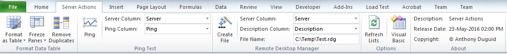

# ServerActions
This is an Excel 2010 Addin written in VBA. It allows the user to use an Excel table to ping a list of servers and create a file for Microsoft Remote Desktop Manager.

<h1 align="center">
  
</h1>

## Functionality
This Excel ribbon named “Server Actions” is inserted after the “Home” tab when Excel opens.  Listed below is the detailed functionality of this application and its components.  

### Format Data Table (Group)
These buttons have the following constraints: 
* Only runs on visible columns/rows. 

####	Format as Table (Button)
* Quickly format a range of cells and convert it to a Table by choosing a pre-defined Table Style. 

####	Freeze Panes (Button)
* Keep a portion of the sheet visible while the rest of the sheet scrolls
* Defaults to invisible from the install

#### Remove Duplicates (Button)
* Delete duplicate rows from a sheet
* Defaults to invisible from the install

###	Ping Test (Group)

####	Ping (Button)
* This will ping the visible servers in the active table.

####	Server Column (Dropdown)
* A list of column names from the active table.

####	Ping Column (Dropdown)
* A list of column names from the active table. If the column doesn't exist, it will be created.

###	Remote Desktop Manager (Group)

####	Create File (Button)
* Creates a Remote Desktop Manager file of the active table list of servers

####	Server (Dropdown)
* A list of column names from the active table.

####	Description (Dropdown)
* A list of column names from the active table.

####	File Name (Textbox)
* The file name to save the list of servers for Remote Desktop Manager.

###	Options (Group)

####	Refresh Lists (Button)
* Refreshes all the dropdown values from the active table column names.

####	Visual Basic (Button)
* Opens the Visual Basic editor.

###	About (Group)

#### Description (Label)
* The application name with the version

#### Install Date (Label)
* The install date of the application

#### Copyright (Label)
* The author’s name

## Dependencies
|Software                        |Dependency                 |
|:-------------------------------|:--------------------------|
|Visual Basic for Applications|Code|
|[Extensible Markup Language (XML)](https://www.rondebruin.nl/win/s2/win001.htm)|Ribbon|
|[Remote Desktop Manager](https://www.microsoft.com/en-au/download/details.aspx?id=44989)|Export File|
