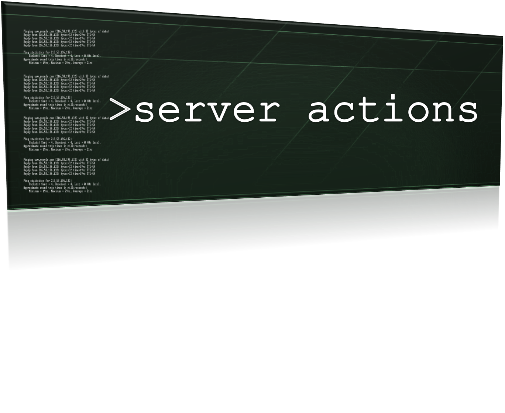
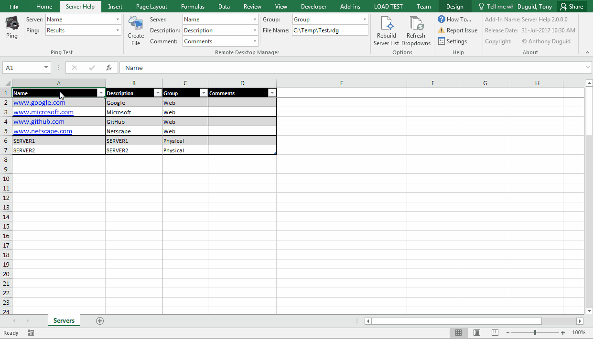
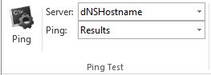
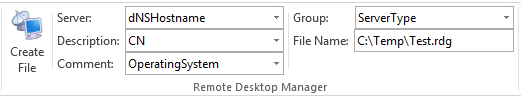
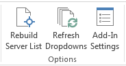
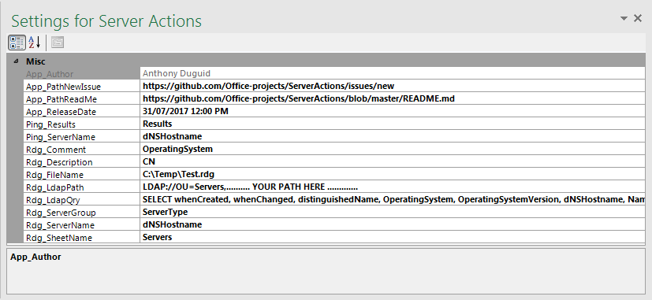
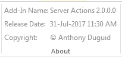

<html>
<head>
</head>



This Add-In allows the user to ping a list of servers and creates a file for [Microsoft Remote Desktop Manager](https://www.microsoft.com/en-au/download/details.aspx?id=44989) from an Excel table. This is used for quickly determining which servers are offline in a list. It is written in 3 different versions as a VSTO Add-In in C# and VB.NET as well as a VBA Add-In.

<!--[](https://www.paypal.me/AnthonyDuguid/1.00)-->
[](https://gitter.im/ServerActions/Lobby?utm_source=badge&utm_medium=badge&utm_campaign=pr-badge&utm_content=badge)
[](LICENSE "MIT License Copyright © Anthony Duguid")
[](https://github.com/Excel-projects/Server-Help/releases)
[](https://github.com/Excel-projects/Server-Help/commits/master)
[](https://github.com/Excel-projects/Server-Help/issues)
<!--[](https://github.com/Excel-projects/Server-Help/releases)-->

<h1 align="center">
  
</h1>

## Table of Contents
- <a href="#install">Install</a>
- <a href="#dependencies">Dependencies</a>
- <a href="#glossary-of-terms">Glossary of Terms</a>
- <a href="#functionality">Functionality</a>
    - <a href="#ping-test">Ping Test</a>
    - <a href="#remote-desktop-manager">Remote Desktop Manager</a>
    - <a href="#options">Options</a>
    - <a href="#help">Help</a>
    - <a href="#about">About</a>
<!---
    - <a href="#ping-test">Ping Test</a>
        - <a href="#ping">Ping (button)</a>
        - <a href="#server-column">Server</a>
        - <a href="#ping-column">Ping</a>
    - <a href="#remote-desktop-manager">Remote Desktop Manager</a>
        - <a href="#create-file">Create File</a>
        - <a href="#server">Server</a>
        - <a href="#description">Description</a>
        - <a href="#comment">Comment</a>
        - <a href="#group">Group</a>
        - <a href="#file-name">File Name</a>
    - <a href="#options">Options</a>
        - <a href="#rebuild-list">Rebuild Server List</a>
        - <a href="#refresh-lists">Refresh Dropdowns</a>
        - <a href="#settings">Add-In Settings</a>
    - <a href="#help">Help</a>
        - <a href="#how-to">How To...</a>
        - <a href="#report-issue">Report Issue</a>
        - <a href="#new-version">New Version Is Available</a>
    - <a href="#about">About</a>
        - <a href="#description">Add-in Name</a>
        - <a href="#release-date">Release Date</a>  
        - <a href="#copyright">Copyright</a>  
--->

<br>

<a id="user-content-install" class="anchor" href="#install" aria-hidden="true"> </a>
## Install
Instructions for installation of VBA and VSTO versions.

### VBA
How to install the VBA version
1. Download the VBA Add-In file [](https://github.com/Excel-projects/Server-Help/raw/master/VBA/ServerHelp.xlam?raw=true "Download the VBA Add-In").
2. Copy the file to the XLSTART folder on your computer. ```%AppData%\Microsoft\Excel\XLSTART\```
3. Close all open instances of Excel and then launch Excel. The new ribbon should appear.

### VSTO
How to install the VSTO version
1. Download AnthonyDuguid.pfx And Install At Root Level [](https://github.com/Excel-projects/Server-Help/blob/master/VB/AnthonyDuguid.pfx?raw=true "Download AnthonyDuguid.pfx And Install At Root Level For VSTO")
2. Download and run the setup.exe file.
[](https://github.com/Excel-projects/Server-Help/blob/master/VB/publish/setup.exe?raw=true "Download Setup.exe Install File")

<br>

<a id="user-content-dependencies" class="anchor" href="#dependencies" aria-hidden="true"> </a>
## Dependencies
|Software                        |Dependency                 |Project                    |
|:-------------------------------|:--------------------------|:--------------------------|
|[Microsoft Visual Studio Community](https://www.visualstudio.com/vs/whatsnew/)|Solution|VSTO|
|[Microsoft Office Developer Tools](https://visualstudio.microsoft.com/vs/features/office-tools/)|Solution|VSTO|
|[Microsoft Excel 2010 (or later)](https://www.microsoft.com/en-au/software-download/office)|Project|VBA, VSTO|
|[Visual Basic for Applications](https://msdn.microsoft.com/en-us/vba/vba-language-reference)|Code|VBA|
|[Extensible Markup Language (XML)](https://www.rondebruin.nl/win/s2/win001.htm)|Ribbon|VBA, VSTO|
|[Remote Desktop Manager](https://www.microsoft.com/en-au/download/details.aspx?id=44989)|Export File|VBA, VSTO|
|[ScreenToGif](http://www.screentogif.com/)|Read Me|VBA, VSTO|
|[Snagit](http://discover.techsmith.com/snagit-non-brand-desktop/?gclid=CNzQiOTO09UCFVoFKgod9EIB3g)|Read Me|VBA, VSTO|
|Badges ([Library](https://shields.io/), [Custom](https://rozaxe.github.io/factory/), [Star/Fork](http://githubbadges.com))|Read Me|VBA, VSTO|

<br>

<a id="user-content-glossary-of-terms" class="anchor" href="#glossary-of-terms" aria-hidden="true"> </a>
## Glossary of Terms

| Term                      | Meaning                                                                                  |
|:--------------------------|:-----------------------------------------------------------------------------------------|
| COM |Component Object Model (COM) is a binary-interface standard for software components introduced by Microsoft in 1993. It is used to enable inter-process communication and dynamic object creation in a large range of programming languages. COM is the basis for several other Microsoft technologies and frameworks, including OLE, OLE Automation, ActiveX, COM+, DCOM, the Windows shell, DirectX, UMDF and Windows Runtime.  |
| Ping |Ping is a computer network administration software utility used to test the reachability of a host on an Internet Protocol (IP) network. It measures the round-trip time for messages sent from the originating host to a destination computer that are echoed back to the source. Ping operates by sending Internet Control Message Protocol (ICMP/ICMP6 ) Echo Request packets to the target host and waiting for an ICMP Echo Reply. The program reports errors, packet loss, and a statistical summary of the results, typically including the minimum, maximum, the mean round-trip times, and standard deviation of the mean. The command-line options of the ping utility and its output vary between the numerous implementations. Options may include the size of the payload, count of tests, limits for the number of network hops (TTL) that probes traverse, and interval between the requests. Many systems provide a companion utility ping6, for testing on Internet Protocol version 6 (IPv6) networks. |
| VBA |Visual Basic for Applications (VBA) is an implementation of Microsoft's event-driven programming language Visual Basic 6 and uses the Visual Basic Runtime Library. However, VBA code normally can only run within a host application, rather than as a standalone program. VBA can, however, control one application from another using OLE Automation. VBA can use, but not create, ActiveX/COM DLLs, and later versions add support for class modules.|
| VSTO |Visual Studio Tools for Office (VSTO) is a set of development tools available in the form of a Visual Studio add-in (project templates) and a runtime that allows Microsoft Office 2003 and later versions of Office applications to host the .NET Framework Common Language Runtime (CLR) to expose their functionality via .NET.|
| XML |Extensible Markup Language (XML) is a markup language that defines a set of rules for encoding documents in a format that is both human-readable and machine-readable. The design goals of XML emphasize simplicity, generality, and usability across the Internet. It is a textual data format with strong support via Unicode for different human languages. Although the design of XML focuses on documents, the language is widely used for the representation of arbitrary data structures such as those used in web services.|

<body>

<br>

<a id="user-content-functionality" class="anchor" href="#functionality" aria-hidden="true"> </a>
## Functionality
This Excel ribbon is inserted after the “Home” tab when Excel opens. Listed below is the detailed functionality of this application and its components.  

<a id="user-content-ping-test" class="anchor" href="#ping-test" aria-hidden="true"> </a>
###	Ping Test (Group)
<h1 align="left">
  
</h1>

<a id="user-content-ping" class="anchor" href="#ping" aria-hidden="true"> </a>
####	Ping (Button)
* This will create the column if it doesn't already exist and then ping the visible servers in the active table.

<a id="user-content-server-column" class="anchor" href="#server-column" aria-hidden="true"> </a>
####	Server (Dropdown)
* A list of column names from the active table.

<a id="user-content-ping-column" class="anchor" href="#ping-column" aria-hidden="true"> </a>
####	Ping (Dropdown)
* A list of column names from the active table. If the column doesn't exist, it will be created.

<a id="user-content-remote-desktop-manager" class="anchor" href="#remote-desktop-manager" aria-hidden="true"> </a>
###	Remote Desktop Manager (Group)
<h1 align="left">
  
</h1>

<a id="user-content-create-file" class="anchor" href="#create-file" aria-hidden="true"> </a>
####	Create File (Button)
* Creates a Remote Desktop Manager file of the active table list of servers

<a id="user-content-server" class="anchor" href="#server" aria-hidden="true"> </a>
####	Server (Dropdown)
* A list of column names from the active table.

<a id="user-content-description" class="anchor" href="#description" aria-hidden="true"> </a>
####	Description (Dropdown)
* A list of column names from the active table.

<a id="user-content-comment" class="anchor" href="#comment" aria-hidden="true"> </a>
####	Comment (Dropdown)
* A list of column names from the active table.

<a id="user-content-group" class="anchor" href="#group" aria-hidden="true"> </a>
####	Group (Dropdown)
* A list of column names from the active table. This is used to group the servers in the remote desktop mananger file.

<a id="user-content-file-name" class="anchor" href="#file-name" aria-hidden="true"> </a>
####	File Name (Textbox)
* The file name to save the list of servers for Remote Desktop Manager.

<a id="user-content-options" class="anchor" href="#options" aria-hidden="true"> </a>
###	Options (Group)
<h1 align="left">
  
</h1>

<a id="user-content-rebuild-list" class="anchor" href="#rebuild-list" aria-hidden="true"> </a>
####	Rebuild Server List (Button)
* Rebuilds the server list from a LDAP query stored in the settings

<a id="user-content-refresh-lists" class="anchor" href="#refresh-lists" aria-hidden="true"> </a>
####	Refresh Dropdowns (Button)
* Refreshes all the dropdown values from the active table column names.

<a id="user-content-help" class="anchor" href="#help" aria-hidden="true"> </a>
###	Help (Group)


<a id="user-content-how-to" class="anchor" href="#how-to" aria-hidden="true"> </a>
####	How To... (Button)
* Opens the how to guide in a browser

<a id="user-content-report-issue" class="anchor" href="#report-issue" aria-hidden="true"> </a>
####	Report Issue (Button)
* Opens the new issue page in a browser

<a id="user-content-settings" class="anchor" href="#settings" aria-hidden="true"> </a>
####	Add-In Settings (Button)
* Opens the settings form/taskpane

<kbd>
VSTO
<br>
  
</kbd>

- Types of VSTO Settings
  - Application Settings
    - These settings can only be changed in the project and need to be redeployed
    - They will appear disabled in the form
  - User Settings
    - These settings can be changed by the end-user
    - They will appear enabled in the form
    
<kbd>
VBA
<br>
  
</kbd>

- VBA Settings
  - To add a new setting
    ```vbnet
    ThisWorkbook.CustomDocumentProperties.Add _
    Name:="App_ReleaseDate" _
    , LinkToContent:=False _
    , Type:=msoPropertyTypeDate _
    , Value:="31-Jul-2017 1:05pm"
    ```
  - To update a setting
    ```vbnet
    ThisWorkbook.CustomDocumentProperties.Item("App_ReleaseDate").Value = "31-Jul-2017 1:05pm"
    ```
  - To delete a setting
    ```vbnet
    ThisWorkbook.CustomDocumentProperties.Item("App_ReleaseDate").Delete
    ```
    

<a id="user-content-about" class="anchor" href="#about" aria-hidden="true"> </a>
###	About (Group)

<h1 align="left">
  
</h1>

<a id="user-content-description" class="anchor" href="#description" aria-hidden="true"> </a>
#### Add-in Name (Label)
* The application name with the version

<a id="user-content-release-date" class="anchor" href="#release-date" aria-hidden="true"> </a>
#### Release Date (Label)
* The release date of the application

<a id="user-content-copyright" class="anchor" href="#copyright" aria-hidden="true"> </a>
#### Copyright (Label)
* The author’s name

</body>
</html>
