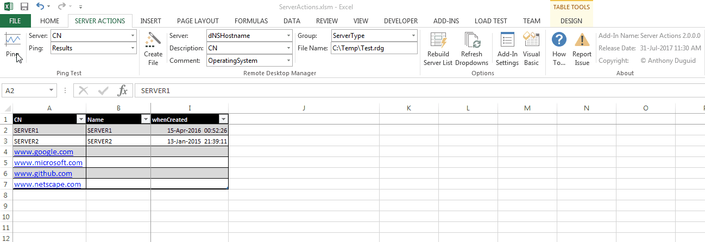

# Server Actions  2.0.0.0
This is an Excel Addin written in VBA. It allows the user to use an Excel table to ping a list of servers and create a file for Microsoft Remote Desktop Manager. This is used for quickly determining which servers are offline in a list.
<h1 align="center">
  
</h1>

## Table of Contents
- <a href="#dependencies">Dependencies</a>
- <a href="#glossary-of-terms">Glossary of Terms</a>
- <a href="#functionality">Functionality</a>
    - <a href="#format-data-table">Format Data Table</a>
        - <a href="#format-as-table">Format as Table</a>
        - <a href="#freeze-panes">Freeze Panes</a>
        - <a href="#remove-duplicates">Remove Duplicates</a>
    - <a href="#ping-test">Ping Test</a>
        - <a href="#ping">Ping</a>
        - <a href="#server-column">Server Column</a>
        - <a href="#ping-column">Ping Column</a>
    - <a href="#remote-desktop-manager">Remote Desktop Manager</a>
        - <a href="#create-file">Create File </a>
        - <a href="#server">Server</a>
        - <a href="#description">Description</a>
        - <a href="#file-name">File Name</a>
    - <a href="#options">Options</a>
        - <a href="#refresh-lists">Refresh Lists</a>
        - <a href="#visual-basic">Visual Basic</a>
    - <a href="#about">About</a>

## Dependencies
|Software                        |Dependency                 |
|:-------------------------------|:--------------------------|
|[Visual Basic for Applications](https://msdn.microsoft.com/en-us/vba/vba-language-reference)|Code|
|[Extensible Markup Language (XML)](https://www.rondebruin.nl/win/s2/win001.htm)|Ribbon|
|[Remote Desktop Manager](https://www.microsoft.com/en-au/download/details.aspx?id=44989)|Export File|
|[ScreenToGif](http://www.screentogif.com/)|Read Me|
|[Snagit](http://discover.techsmith.com/snagit-non-brand-desktop/?gclid=CNzQiOTO09UCFVoFKgod9EIB3g)|Read Me|

## Glossary of Terms

| Term                      | Meaning                                                                                  |
|:--------------------------|:-----------------------------------------------------------------------------------------|
| Ping |Ping is a computer network administration software utility used to test the reachability of a host on an Internet Protocol (IP) network. It measures the round-trip time for messages sent from the originating host to a destination computer that are echoed back to the source. Ping operates by sending Internet Control Message Protocol (ICMP/ICMP6 ) Echo Request packets to the target host and waiting for an ICMP Echo Reply. The program reports errors, packet loss, and a statistical summary of the results, typically including the minimum, maximum, the mean round-trip times, and standard deviation of the mean. The command-line options of the ping utility and its output vary between the numerous implementations. Options may include the size of the payload, count of tests, limits for the number of network hops (TTL) that probes traverse, and interval between the requests. Many systems provide a companion utility ping6, for testing on Internet Protocol version 6 (IPv6) networks. |
| VBA |Visual Basic for Applications (VBA) is an implementation of Microsoft's event-driven programming language Visual Basic 6 and uses the Visual Basic Runtime Library. However, VBA code normally can only run within a host application, rather than as a standalone program. VBA can, however, control one application from another using OLE Automation. VBA can use, but not create, ActiveX/COM DLLs, and later versions add support for class modules.|
| XML |Extensible Markup Language (XML) is a markup language that defines a set of rules for encoding documents in a format that is both human-readable and machine-readable. The design goals of XML emphasize simplicity, generality, and usability across the Internet. It is a textual data format with strong support via Unicode for different human languages. Although the design of XML focuses on documents, the language is widely used for the representation of arbitrary data structures such as those used in web services.|

## Functionality
This Excel ribbon named “Server Actions” is inserted after the “Home” tab when Excel opens.  Listed below is the detailed functionality of this application and its components.  

### Format Data Table (Group)
These buttons have the following constraints: 
* Only runs on visible columns/rows. 

####	Format as Table (Button)
* Quickly format a range of cells and convert it to a Table by choosing a pre-defined Table Style. 

####	Freeze Panes (Button)
* Keep a portion of the sheet visible while the rest of the sheet scrolls
* Defaults to invisible from the install

#### Remove Duplicates (Button)
* Delete duplicate rows from a sheet
* Defaults to invisible from the install

###	Ping Test (Group)

####	Ping (Button)
* This will ping the visible servers in the active table.

####	Server Column (Dropdown)
* A list of column names from the active table.

####	Ping Column (Dropdown)
* A list of column names from the active table. If the column doesn't exist, it will be created.

###	Remote Desktop Manager (Group)

####	Create File (Button)
* Creates a Remote Desktop Manager file of the active table list of servers

####	Server (Dropdown)
* A list of column names from the active table.

####	Description (Dropdown)
* A list of column names from the active table.

####	File Name (Textbox)
* The file name to save the list of servers for Remote Desktop Manager.

###	Options (Group)

####	Refresh Lists (Button)
* Refreshes all the dropdown values from the active table column names.

####	Visual Basic (Button)
* Opens the Visual Basic editor.

###	About (Group)

#### Description (Label)
* The application name with the version

#### Install Date (Label)
* The install date of the application

#### Copyright (Label)
* The author’s name
